## Jenkins Pipelines Job

A jenkins pipeline job is a way to define and automate a series of steps in software delivery. It allows you to script and organise your entire build, test, and deployment processes as code.

## Creating our first pipeline job

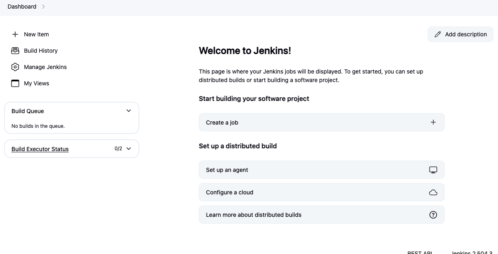

## Writing Jenkins Pipeline script

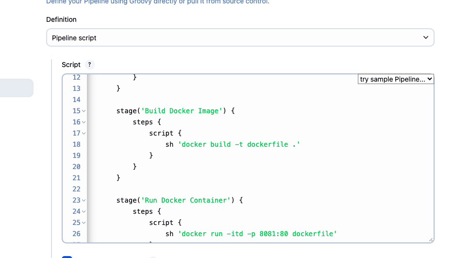
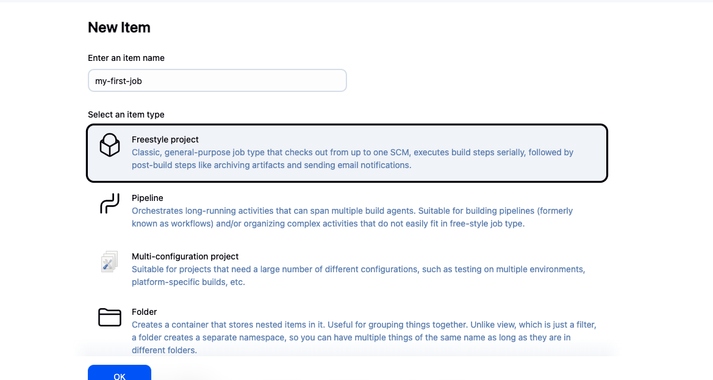

## Install docker on EC2 instance
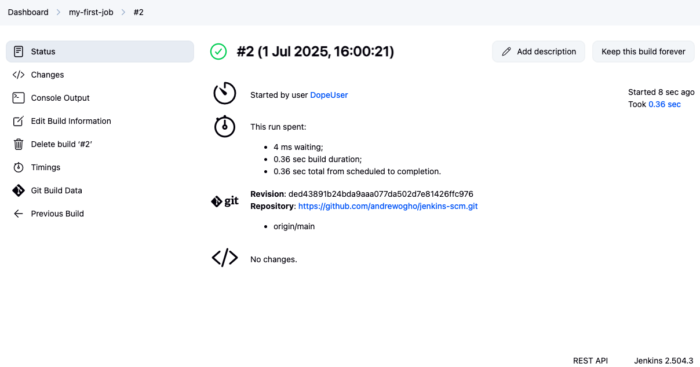

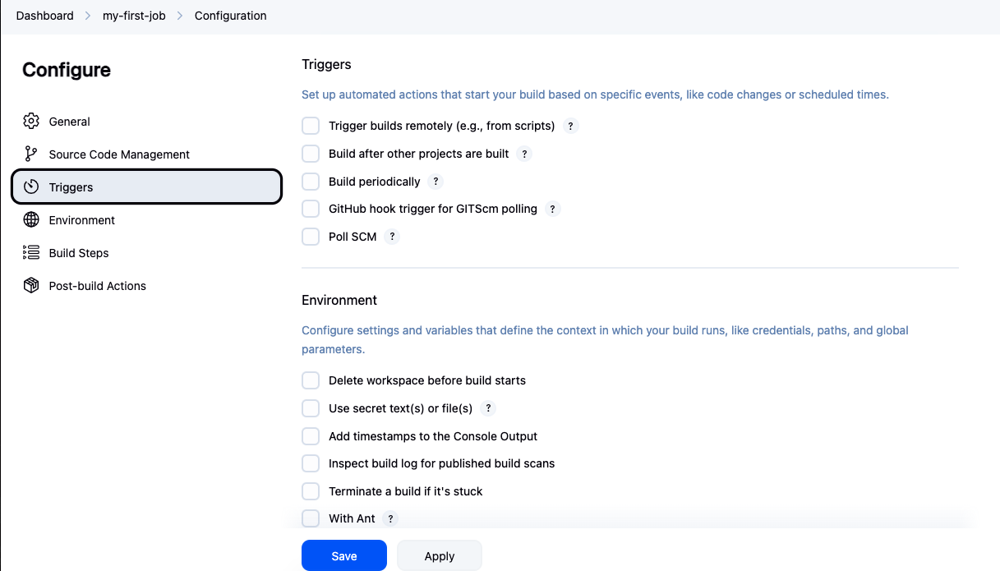
create dockerfile 
build dockerfile 
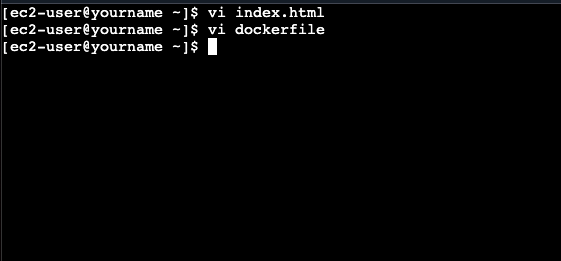
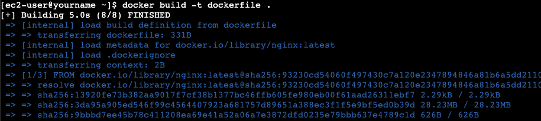
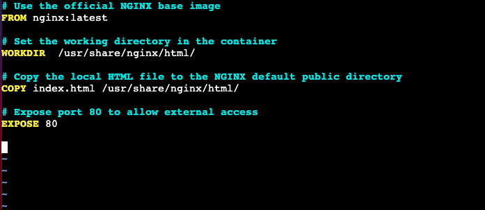
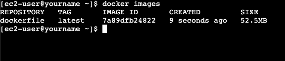

## Edit Inbound Rules
to allow custom TCP 8081

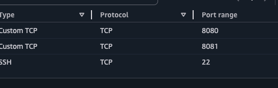

## Finally access webserver
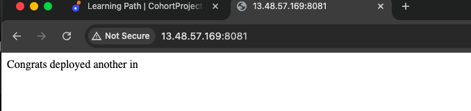