## Overview

This guide walks you through deploying Jenkins—a leading open-source automation server—on an AWS EC2 instance using the AWS CLI and standard package managers. It covers prerequisites, EC2 provisioning, SSH access, Jenkins installation, initial setup, optional enhancements, and basic troubleshooting.


## SSH into EC2 and Install Jenkins
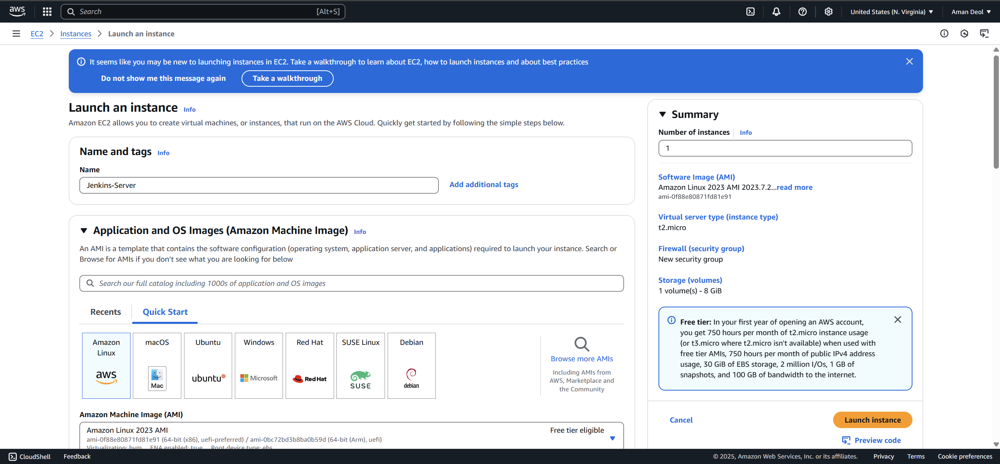

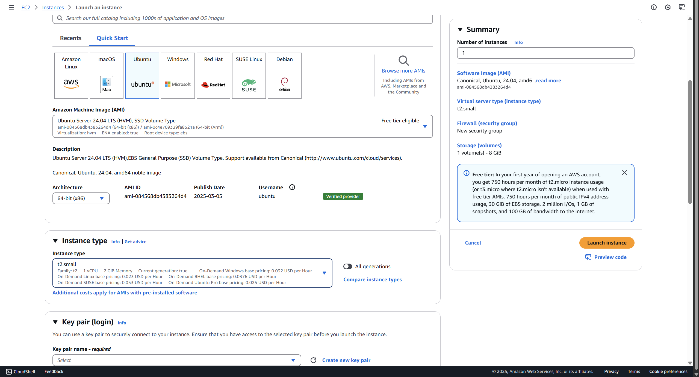

**Update System & Install Java 11**
   On Amazon Linux 2:

   ```bash
   sudo yum update -y
   sudo amazon-linux-extras install java-openjdk11 -y
   ```

   Jenkins requires Java 11 or newer. 
**Add Jenkins Repo & Install**

   ```bash
   # Import Jenkins GPG key
   sudo wget -O /etc/yum.repos.d/jenkins.repo \
     https://pkg.jenkins.io/redhat-stable/jenkins.repo
   sudo rpm --import https://pkg.jenkins.io/redhat-stable/jenkins.io.key

   # Install Jenkins
   sudo yum install jenkins -y
   ```

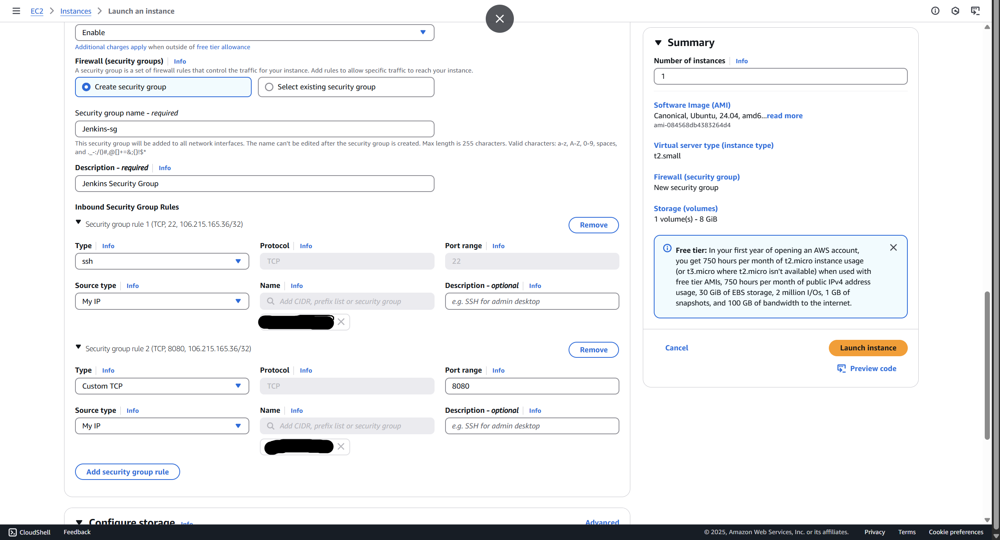
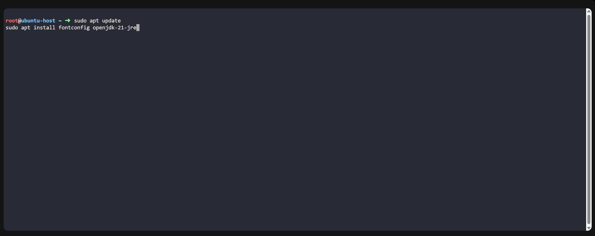
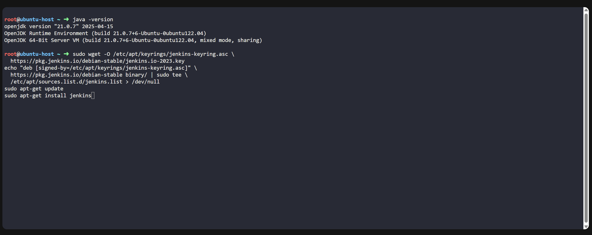


**Start & Enable Jenkins**

   ```bash
   sudo systemctl start jenkins
   sudo systemctl enable jenkins
   ```

   This ensures Jenkins launches on boot.
**Verify Status**

   ```bash
   sudo systemctl status jenkins
   ```

   Confirm the service is active and running.

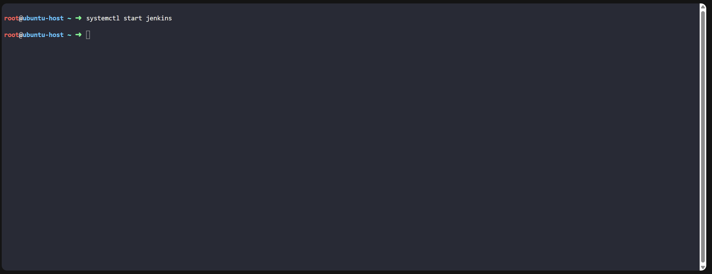


## Initial Jenkins Configuration

   ```bash
   sudo cat /var/lib/jenkins/secrets/initialAdminPassword
   ```

   Copy and paste this into the setup wizard.
3. **Install Suggested Plugins**
   Choose “Install suggested plugins” to get a typical CI/CD toolchain. 
4. **Create First Admin User**
   Set a username, password, and email for your primary administrator.
5. **Finalize Instance Configuration**
   Confirm the Jenkins URL (defaults to your EC2 IP) and finish setup.

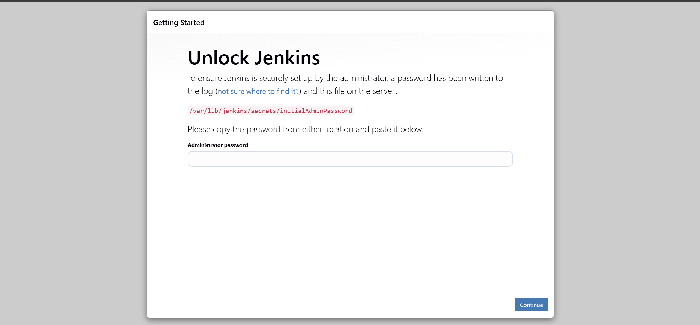
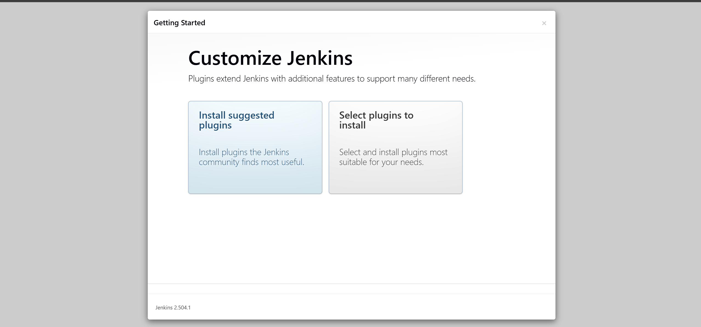
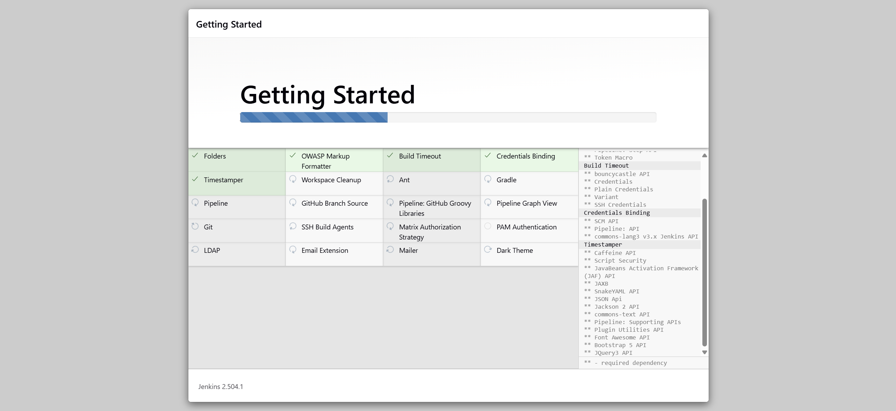
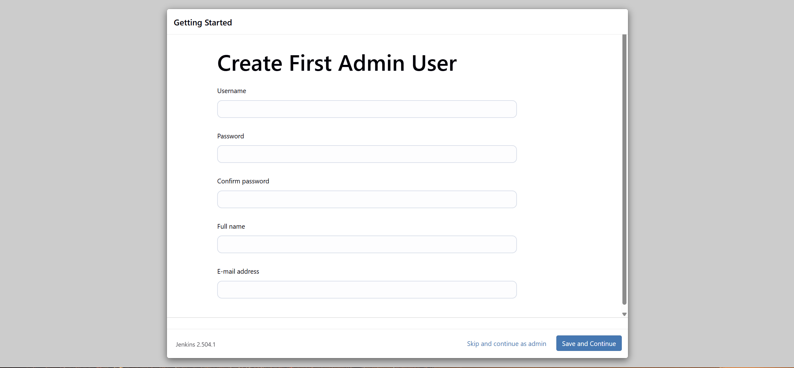
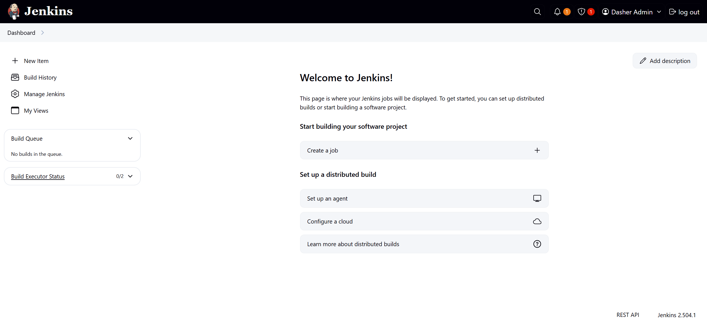   

## Troubleshooting

* **Jenkins Fails to Start**

  ```bash
  journalctl -u jenkins -b
  ```

  Inspect logs for errors.
* **Port 8080 Inaccessible**

  * Verify security group inbound rules.
  * Check local firewall (`firewalld`/`ufw`).